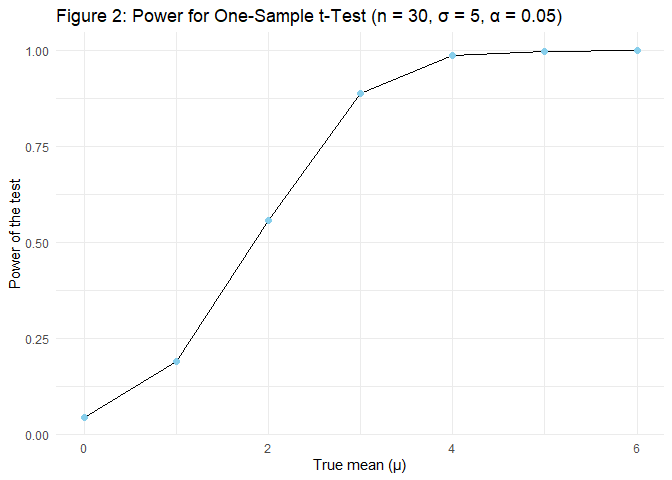
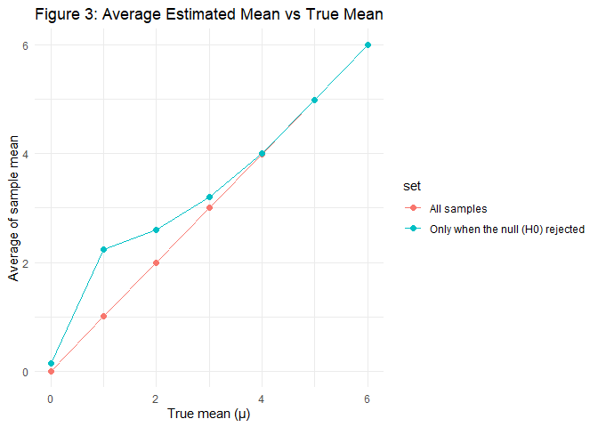

p8105_hw5_ns3923
================

**Set up necessary library**

``` r
library(tidyverse)
```

## Problem 1

**Goal:** To estimate the probability that at least two people share a
birthday for group sizes 2–50 using 10,000 simulations each.

**1) Define a function that simulates random birthdays for a group of
size n and returns TRUE if any birthdays are shared.**

``` r
set.seed(123)

dup_bday = function(n, days = 365) {
  birthdays = sample.int(days, size = n, replace = TRUE)
  any(duplicated(birthdays))
}

#Check
test_results =
  tibble(
    group_size = c(2, 10, 15, 60),
    shared_bday = map_lgl(group_size, dup_bday)
  )
test_results
```

    ## # A tibble: 4 × 2
    ##   group_size shared_bday
    ##        <dbl> <lgl>      
    ## 1          2 FALSE      
    ## 2         10 FALSE      
    ## 3         15 TRUE       
    ## 4         60 TRUE

From the checking table above, smaller group sizes such as 2 and 10
people are less likely to have a shared birthday, as shown by
`shared_bday = FALSE`. In contrast, larger groups, especially with 60
people, have a higher chance of at least one shared birthday
(`shared_bday = TRUE`). This makes sense because the more people in a
group, the greater the chance that two will share the same birthday.

**2) Repeat the simulation 10,000 times for each group size between 2
and 50, and calculate the probability of a shared birthday**

``` r
Repeat_group =
  expand_grid(group_size = 2:50, iter = 1:10000) |>
  mutate(dup = map_lgl(group_size, dup_bday)) |>
  group_by(group_size) |>
  summarize(prob_duplicate = mean(dup), .groups = "drop")
```

**3) Make a plot showing the probability as a function of group size**

``` r
Repeat_group |>
  ggplot(aes(x = group_size, y = prob_duplicate)) +
  geom_line() +
  geom_point(size = 2, color = "skyblue") +
  theme_minimal()
```

<!-- -->

``` r
  labs(
    title = "Problem 1: Probability of at least 2 people shared birthday",
    x = "Group Size (n)",
    y = "Probability"
  ) 
```

    ## <ggplot2::labels> List of 3
    ##  $ x    : chr "Group Size (n)"
    ##  $ y    : chr "Probability"
    ##  $ title: chr "Problem 1: Probability of at least 2 people shared birthday"

**Explain:** The trend is upward as the group size increases, meaning
that larger groups have a higher probability of two people sharing a
birthday. The probability rises and approaches 1 as the group becomes
larger. Around 23 people, the chance of a shared birthday is about 50%.

## Problem 2

**Goal:** To conduct a simulation to explore power in a one-sample
t-test by simulating 5,000 datasets for each true mean
`μ ∈ {0,1,2,3,4,5,6}` with n = 30 and σ = 5.

**1) Set the design elements: n=30, σ=5, μ=0**

``` r
set.seed(123)

n        = 30
sigma    = 5
mu_values = 0:6
```

**2) Generate 5,000 datasets from the model x∼Normal\[μ,σ\]**

``` r
##Create a function to simulate one dataset and run a one-sample t-test
sim_ttest = function(mu) {
  x = rnorm(n, mean = mu, sd = sigma)
  broom::tidy(t.test(x, mu = 0)) |>
  dplyr::select(estimate, p.value)
}

##Repeat the simulation 5,000 times for each μ
sim_results =
  expand_grid(mu = mu_values, iter = 1:5000) |>
  mutate(test_res = map(mu, sim_ttest)) |>
  unnest(test_res) |>
  mutate(reject = p.value < 0.05)
```

**3) Plot power curve and mean-estimate plots**

``` r
## power curve
power_df =
  sim_results |>
  group_by(mu) |>
  summarize(power = mean(reject), .groups = "drop")

power_df |>
  ggplot(aes(x = mu, y = power)) +
  geom_line() +
  geom_point(size = 2, color = "skyblue") +
  theme_minimal() +
  labs(
    title = "Problem 2: Power for One-Sample t-Test (n = 30, σ = 5, α = 0.05)",
    x = "True mean (μ)",
    y = "Power of the test"
  ) 
```

<!-- -->

**Explain:** As the true mean increases, the power of the test also
increases. Therefore, there is a positive association between effect
size and power, meaning that larger effect sizes are more likely to lead
the test to detect a true difference and reject the null hypothesis.
From the beginning, the true mean is close to 0 and the power is around
0.05, reflecting the significance level of 5%.

``` r
## mean-estimate plots
mean_estimates =
  sim_results |>
  group_by(mu) |>
  summarize(
    mean_all   = mean(estimate),
    mean_reject = mean(estimate[reject]),
    .groups = "drop"
  )

mean_estimates |>
  pivot_longer(mean_all:mean_reject,
               names_to = "set", values_to = "avg_est") |>
  mutate(set = recode(set,
                      mean_all   = "All samples",
                      mean_reject = "Only when the null (H0) rejected")) |>
  ggplot(aes(x = mu, y = avg_est, color = set)) +
  geom_line() +
  geom_point(size = 2) +
  theme_minimal() +
  labs(
    title = "Problem 2: Average Estimated Mean vs True Mean",
    x = "True mean (μ)",
    y = "Average of sample mean"
  ) 
```

<!-- -->

**Is the average of sample mean across tests for which the null is
rejected approximately equal to the true value of μ? Why or why not?**
**Answer:** Even though the red line (all samples) and the blue line
(only when rejecting the null) seem close and look almost identical at
higher true means, the average sample mean is not equal to the true
mean, especially when the true mean is small. The blue line is clearly
higher than the red line, showing that the average of the sample means
tends to overestimate the true mean. As a result, their average is
slightly higher than the true mean.
